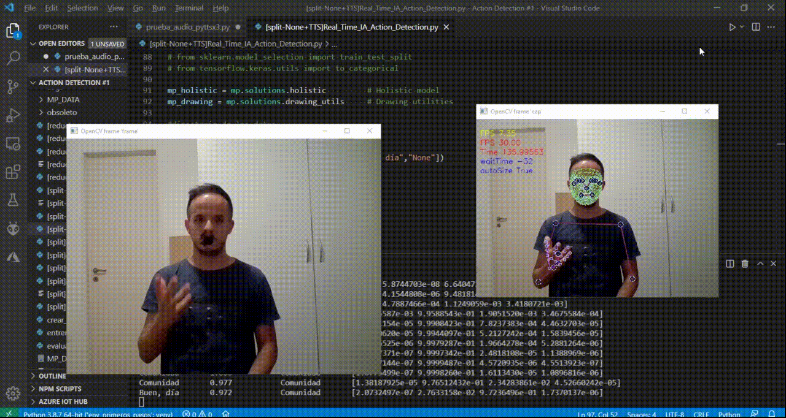

# Registro de cambios - Changelog

## SEO

- Cambio de Titulo por un título más descriptivo:
    ```html
    <title>Portfolio Desarrollador Web - Paolo Sartori</title>
    ```

- Incorporación de keywords *(aunque estén deprecadas en Google)* :
    ```html
    <meta name="keywords" content="Desarrollo Web, Portfolio, web, web3, Software, HTML, CSS, Inteligencia Artificial, Deep Learning, Machine Learning">
    ```

- Incorporación del resto de meta tags referentes al SEO como `description`, `author`, `robots`, etc :
    ```html
    <!-- SEO -->
    <title>Portfolio Desarrollador Web - Paolo Sartori</title>
    <meta name="description" content="Soy una persona que le gusta buscar soluciones a problemas utilizando herramientas tecnológicas, y facilitar la vida de las personas de este modo. Apasionado de las Finanzas, Stocks, Crypto y DeFi. Estoy buscando nuevos desafíos hacia el camino de la Programación y el Software.">
    <meta name="keywords" content="Desarrollo Web, Portfolio, web, web3, Software, HTML, CSS, Inteligencia Artificial, Deep Learning, Machine Learning">
    <meta name="robots" content="index">
    <meta name="author" content="Paolo Sartori">
    <link rel="canonical" href="./index.html">
    ```

- Incorporación de los Open Graph tags para redes sociales:
    ```html
    <!-- Open Graph - Social Netw -->
    <meta name="og:title" content="Portfolio Desarrollador Web - Paolo Sartori">
    <meta name="og:site_name" content="Portfolio Desarrollador Web - Paolo Sartori">
    <meta name="og:type" content="website">
    <meta name="og:description" content="Soy una persona que le gusta buscar soluciones a problemas utilizando herramientas tecnológicas, y facilitar la vida de las personas de este modo. Apasionado de las Finanzas, Stocks, Crypto y DeFi. Estoy buscando nuevos desafíos hacia el camino de la Programación y el Software.">
    <meta name="og:image" content="./assets/img/imagenPerfil.jfif">
    <meta name="og:url" content="./index.html">
    <meta name="twitter:card" content="summary">
    <meta name="twitter:title" content="Portfolio Desarrollador Web - Paolo Sartori">
    <meta name="twitter:image:src" content="./assets/img/perfil.jfif">
    <meta name="twitter:domain" content="./index.html">
    ```

- Mejora en las descripciones de los `alt` de los elementos multimedia (repitiendo la descripción en el atributo `title`):
    ```html
    
    ```
    ```html
    
    ```
    ```html
    
    ```
    ```html
        ...
    ```

- incorporación del atributo `title` a los anchor del footer para que sea más descriptivo para el usuario:
    ```html
    <a href="https://api.whatsapp.com/#####" target="_blank" rel="noopener noreferrer" title="Contante mediante Whatsapp">
            ...
                ...
    <a href="https://api.telegram.com/#####" target="_blank" rel="noopener noreferrer" title="Contacte mediante Telegram">
            ...
                ...
    <a href="https://api.github.com/#####" target="_blank" rel="noopener noreferrer" title="Acceda a nuestro Repositorio">
    ```

- Se quitó el `title` antiguo y el `<script src="./css/style.css` antiguo anterior a la implementación de **Sass**

- Se reemplazo el "logo" estático del NavBar por un anchor anidado que dirigiera hacia la página principal/Home:
    ```HTML
        <header id="headerId">
    +		<a href="./index.html">
                <h2>Paolo Sartori</h2>
    +		</a>
            <nav>
    ```
    - con su respectivo `text-decoration`:
    ```scss
        a {
            text-decoration: none;
        }
    ```

- Se eliminó código comentado ya inutilizado
    ```html
        ...
    <!-- <br> -->
        ...
    ```

- Reemplazo de un GIF que pesaba demasiado y retardaba el tiempo de carga del sitio, por un video `video/mp4` más comprimido y eficiente:
    ```html
    -	<!--  -->
    ```
    ```html
    +	<video src="./assets/video/Real_Time_IA_deaf_sign_MVP (veed.io).mp4" muted autoplay loop></video>
    ```
	- con su correspondiente estilo en Sass:
        ```css
            section#proyectos>div#proyectos_personales_1>div {
                img, video {
                    object-position: 42%;
                }
            }
        ...	img, video {
                width: 10rem;
                height: 10rem;
                max-height: 45vw;
                max-width: 45vw;
                object-fit: cover;
                box-shadow: 0 0 20px -5px;
                margin-inline: 15px;
            }
        ```


## SASS II

- MIXIN:
    ```scss
    @mixin flex_centrado($direction: row) {
        display: flex;
        justify-content: center;
        align-items: center;
        @if $direction==column {
            flex-direction: column;
        }
    }
    ```

- MAPA:
    ```scss
    $list_bulletsMaps: (
        (section: "experiencia", nChild: 3, bullet: "•"),
        (section: "experiencia", nChild: 4, bullet: "•"),
        (section: "experiencia", nChild: 5, bullet: "-"),
        (section: "proyectosLaborales", nChild: 2, bullet: "•"),
        (section: "proyectosLaborales", nChild: 3, bullet: "*"),
        (section: "proyectosLaborales", nChild: 4, bullet: "-"),
        (section: "proyectosLaborales", nChild: 5, bullet: "-"),
    )
    ```

- EXTEND:
    ```scss
        ...
            ...
            &>input[type=reset] {
                background-color: $gradiente-borde-1;
                color: white;
                font-weight: bold;
                padding: 5px;
                flex-grow: 1;
                box-shadow: 0px 0px 7px $color-texto;
                
                &:hover{
                background-color: $color-3;
                background-image: url("https://uploads-ssl.webflow.com/61f03747d8d407ed117df27f/61f116f06248585a2739061f_Button%20BG.png");
                }
            }
        
            &>input[type=submit] {
                @extend [type=reset];
                
                &:hover{
                    background-color: $gradiente-fondo-h2-1;
                    background-image: url("https://uploads-ssl.webflow.com/61f03747d8d407ed117df27f/61f116f06248585a2739061f_Button%20BG.png");
                    background-size: cover;
                }
            }
        ...
    ```